This project is to look at comparing pre vs post-transplantion in two cell lines with two different versions of the Gecko library (A and B), working with Bess Miller from the Scadden lab. The overall goal is to look for genes depleted across both versions of the Gecko library and both cell lines.

We were given tables of counts and the FASTQ files that were used to generate those counts. For a first analysis we'll just use the table of counts instead of redoing the alignment and counting, and leave revisiting aligning as an option.

This report is broken up into two parts, this document contains the data cleaning, quality control of the samples and spitting out the cleaned data for differential expression calling.

The data cleaning involves:

1.  Creating a standard ID for all technical replicates from the same sample.
2.  Summing counts of technical replicates from the multiple sequencing runs.
3.  Creating more rich metadata fields about each sample.
4.  Dropping samples which appear to have failed.

Data prep
=========

Rather than remapping the data we'll start from the count files already generated and see what we can do with them. First we will load in the count files and do some sanity checking to make sure the data is what we are expecting it to be.

``` r
> a_post_fn = "../data/library-a-post-transplant-counts.csv"
> b_post_fn = "../data/library-b-post-transplant-counts.csv"
> a_gecko_fn = "../data/library-a-sequences-and-genes.csv"
> b_gecko_fn = "../data/library-b-sequences-and-genes.csv"
> a_pre_fn = "../data/pre-la.csv"
> b_pre_fn = "../data/pre-lb.csv"
> a_new_fn = "../data/new-library-a-counts.csv"
> b_new_fn = "../data/new-library-b-counts.csv"
```

``` r
> library(readr)
> library(tidyr)
> library(dplyr)
> library(reshape2)
> library(dplyr)
```

The post transplant count file has an extra row called 'Total', we will drop that. We'll also drop any rows from the Gecko files that don't appear in the pre/post transplant count files. We'll drop the extraneous `ID`, `Sequence` and `Plate` columns from the pre transplant count file. We'll make a matrix of the counts such that the row names are the UIDs. Finally we construct a dataframe that has the information we need about each sample regarding what cell line it is from, which Gecko library was used to treat it and whether or not it was a transplanted or non transplanted sample.

``` r
> cleanup_counts = function(fn) {
+     exclude_columns = c("ID", "Sequences", "Plate", "UID")
+     counts = readr::read_csv(fn, col_names = TRUE)
+     colnames(counts)[1] = "UID"
+     counts = data.frame(subset(counts, UID != "Total"))
+     rownames(counts) = counts$UID
+     counts = counts[, !colnames(counts) %in% exclude_columns]
+     return(counts)
+ }
> 
> cleanup_gecko = function(fn, valid) {
+     gecko = readr::read_csv(fn, col_names = TRUE)
+     gecko = data.frame(subset(gecko, UID %in% valid))
+     rownames(gecko) = gecko$UID
+     gecko$UID = NULL
+     return(gecko)
+ }
> 
> combine_pre_post = function(pre, post, library) {
+     return(cbind(pre, post))
+ }
> 
> cleanup_new_counts = function(fn) {
+     counts = readr::read_csv(fn, col_names = TRUE, skip = 1)
+     colnames(counts)[1] = "UID"
+     counts = data.frame(counts[, !is.na(colnames(counts))])
+     rownames(counts) = counts$UID
+     counts$UID = NULL
+     return(counts)
+ }
> 
> 
> derive_sample_data = function(pre, post) {
+     pre_df = data.frame(sample = colnames(pre), transplant = "pre")
+     post_df = data.frame(sample = colnames(post), transplant = "post")
+     pre_df$line = ifelse(grepl("^HM", colnames(pre)), "HM", ifelse(grepl("^MLLAF9", 
+         colnames(pre)), "MLLAF9", NA))
+     post_df$line = ifelse(grepl("^H", colnames(post)), "HM", ifelse(grepl("^M", 
+         colnames(post)), "MLLAF9", NA))
+     pre_df$library = ifelse(grepl(".A", colnames(pre), fixed = TRUE), "A", ifelse(grepl(".B", 
+         colnames(pre), fixed = TRUE), "B", NA))
+     post_df$library = ifelse(grepl("^.A", colnames(post)), "A", ifelse(grepl("^.B", 
+         colnames(post)), "B", NA))
+     combined = rbind(pre_df, post_df)
+     samplenames = combined$sample
+     rownames(combined) = combined$sample
+     mouse = regmatches(samplenames, regexpr("\\d+$", samplenames, perl = TRUE))
+     mouse[!combined$transplant %in% c("post", "pre")] = "none"
+     combined$mouse = mouse
+     combined$replicate = "1"
+     combined$derived = paste(combined$line, combined$library, combined$transplant, 
+         combined$mouse, sep = "_")
+     combined$run = "first"
+     combined = combined[, c("transplant", "line", "library", "mouse", "replicate", 
+         "sample", "derived", "run")]
+     
+     return(combined)
+ }
> 
> derive_new_sample = function(counts, library) {
+     df = data.frame(sample = colnames(counts), library = library)
+     df$line = ifelse(grepl("^HM", colnames(counts)), "HM", ifelse(grepl("^MA", 
+         colnames(counts)), "MLLAF9", ifelse(grepl("_plasmid", colnames(counts)), 
+         "plasmid", ifelse(grepl("Water", colnames(counts)), "water", "none"))))
+     df$transplant = ifelse(grepl("_Pre_", colnames(counts)), "pre", ifelse(grepl("_plasmid", 
+         colnames(counts)), "plasmid", ifelse(grepl("Water", colnames(counts)), 
+         "water", ifelse(grepl("_vitro_", colnames(counts)), "vitro", "post"))))
+     rownames(df) = df$sample
+     df$sample = NULL
+     df$replicate = ifelse(grepl(".1", rownames(df), fixed = TRUE), "1", "2")
+     samplenames = gsub(".1", "", rownames(df), fixed = TRUE)
+     mouse = regmatches(samplenames, regexpr("\\d+$", samplenames, perl = TRUE))
+     mouse[!df$transplant %in% c("post", "pre")] = "none"
+     df$mouse = mouse
+     df$sample = samplenames
+     df$derived = paste(df$line, df$library, df$transplant, df$mouse, sep = "_")
+     df$run = "second"
+     df = df[, c("transplant", "line", "library", "mouse", "replicate", "sample", 
+         "derived", "run")]
+     return(df)
+ }
```

``` r
> a_pre = cleanup_counts(a_pre_fn)
> a_post = cleanup_counts(a_post_fn)
> a_counts = combine_pre_post(a_pre, a_post)
> a_gecko = cleanup_gecko(a_gecko_fn, rownames(a_counts))
> a_sample = derive_sample_data(a_pre, a_post)
> a_sample = a_sample[colnames(a_counts), ]
```

``` r
> b_pre = cleanup_counts(b_pre_fn)
> b_post = cleanup_counts(b_post_fn)
> b_counts = combine_pre_post(b_pre, b_post)
> b_gecko = cleanup_gecko(b_gecko_fn, rownames(b_counts))
> b_sample = derive_sample_data(b_pre, b_post)
> b_sample = b_sample[colnames(b_counts), ]
```

``` r
> a_new_counts = cleanup_new_counts(a_new_fn)
> b_new_counts = cleanup_new_counts(b_new_fn)
> a_new_sample = derive_new_sample(a_new_counts, "A")
> b_new_sample = derive_new_sample(b_new_counts, "B")
```

``` r
> a_combined_counts = cbind(a_counts, a_new_counts)
> a_combined_samples = rbind(a_sample, a_new_sample)
> b_combined_counts = cbind(b_counts, b_new_counts)
> b_combined_samples = rbind(b_sample, b_new_sample)
```

They want to look for genes that are depleted, not the UIDs. The UIDs are not the same across library B and library A, so we need to somehow account for that. We could do something simple like just look at the UIDs that are different in each library and then see which genes are in common across the two libraries. We will do this first, and then get more complex later.

First we'll do some quality control of the samples.

Quality Control
---------------

### Library A

``` r
> library(pheatmap)
> a_metadata = a_combined_samples
> a_metadata$total_counts = colSums(a_combined_counts)
> a_metadata$ltotal_counts = log(a_metadata$total_counts)
```

#### Total counts

There are more counts in the second run of the libraries, however there are still samples that have failed in both runs.

``` r
> library(ggplot2)
> ggplot(a_metadata, aes(x = derived, y = total_counts)) + facet_wrap(~run) + 
+     theme_bw(base_size = 8) + theme(panel.grid.major = element_line(size = 0.5, 
+     color = "grey"), axis.text.x = element_text(angle = 90)) + geom_bar(stat = "identity") + 
+     ylab("total counts") + xlab("")
```

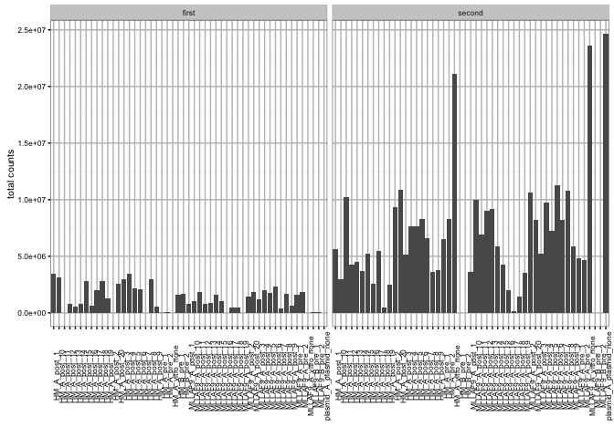

The cutoff seems to be around 100,000 counts, so we'll drop any cells with counts less than that.

``` r
> ggplot(a_metadata, aes(total_counts)) + theme_bw(base_size = 10) + theme(panel.grid.major = element_line(size = 0.5, 
+     color = "grey"), axis.text.x = element_text(angle = 90)) + geom_histogram() + 
+     scale_x_log10()
```

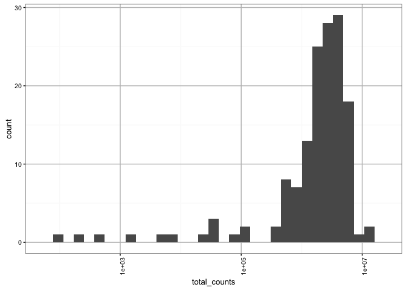

``` r
> a_metadata = subset(a_metadata, total_counts > 1e+05)
> a_combined_counts = a_combined_counts[, rownames(a_metadata)]
```

Fixing that only fixes part of the problem. The distribution of counts per gene for each sample is all over the place too:

``` r
> library(reshape2)
> melted = melt(a_combined_counts)
> colnames(melted) = c("sample", "count")
> melted$sample = factor(melted$sample)
> melted = melted[order(melted$sample), ]
> melted$count = log(melted$count + 1)
> melted = melted %>% left_join(a_metadata, by = "sample")
> ggplot(melted, aes(x = sample, y = count)) + geom_boxplot() + theme_bw(base_size = 10) + 
+     facet_wrap(~run) + theme(panel.grid.major = element_line(size = 0.5, color = "grey"), 
+     axis.text.x = element_text(angle = 90)) + xlab("")
```

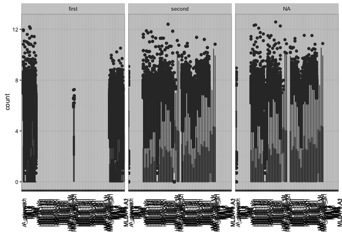

We'd expect if we could reliably measure the counts we should see some similarity in the distribution of the counts.

The overall distribution of counts between the two cell lines is similar, though:

``` r
> ggplot(melted, aes(x = line, y = count)) + geom_boxplot() + theme_bw(base_size = 10) + 
+     facet_wrap(~run) + theme(panel.grid.major = element_line(size = 0.5, color = "grey"), 
+     axis.text.x = element_text(angle = 90)) + xlab("")
```

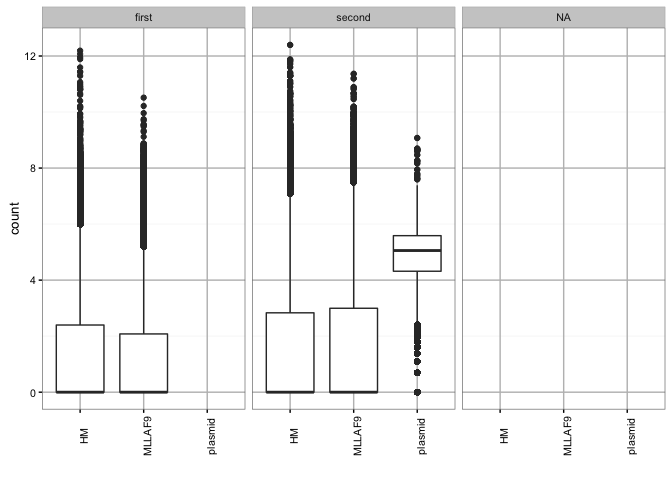

Here we can see that the cells separate out by cell type along the first principal component:

``` r
> library(DESeq2)
> dds = DESeqDataSetFromMatrix(countData = a_combined_counts, colData = a_metadata, 
+     design = ~sample)
> geoMeans = apply(a_combined_counts, 1, function(row) if (all(row == 0)) 0 else exp(mean(log(row[row != 
+     0]))))
> dds = estimateSizeFactors(dds, geoMeans = geoMeans)
> vst = varianceStabilizingTransformation(dds)
> plotPCA(vst, intgroup = c("line"))
```

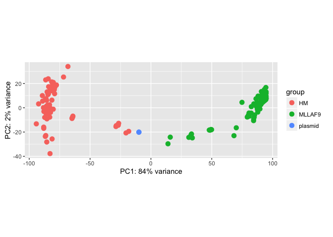

And by log total counts by the second principal component:

``` r
> plotPCA(vst, intgroup = c("ltotal_counts"))
```

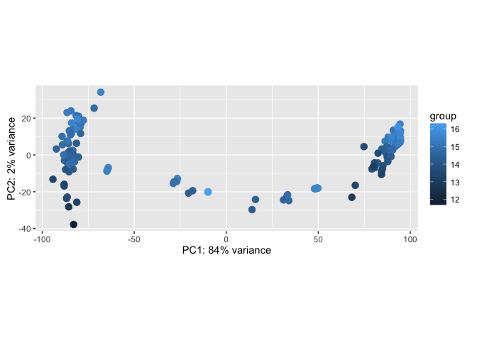

But most of the variance between the samples is explained by the cell line, not the depth of sequencing.

The cluster of samples in the middle are the non-transplanted samples:

``` r
> plotPCA(vst, intgroup = c("transplant"))
```

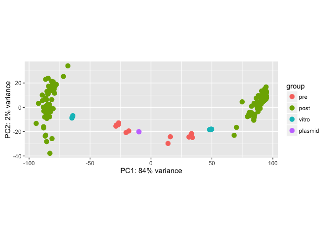

### Library B

``` r
> library(pheatmap)
> b_metadata = b_combined_samples
> b_metadata$total_counts = colSums(b_combined_counts)
> b_metadata$ltotal_counts = log(b_metadata$total_counts)
```

#### Total counts

There are more counts in the second run of the libraries, however there are still samples that have failed in both runs.

``` r
> library(ggplot2)
> ggplot(b_metadata, aes(x = derived, y = total_counts)) + facet_wrap(~run) + 
+     theme_bw(base_size = 8) + theme(panel.grid.major = element_line(size = 0.5, 
+     color = "grey"), axis.text.x = element_text(angle = 90)) + geom_bar(stat = "identity") + 
+     ylab("total counts") + xlab("")
```

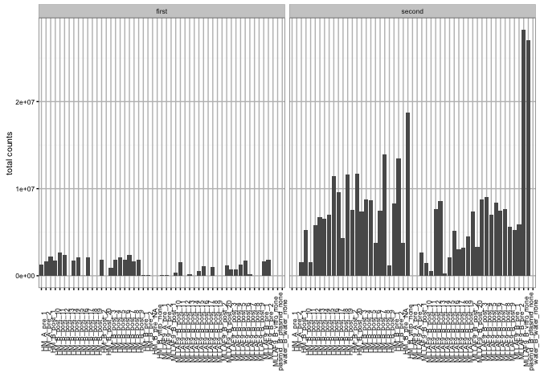

The cutoff seems to be around 100,000 counts, so we'll drop any cells with counts less than that.

``` r
> ggplot(b_metadata, aes(total_counts)) + theme_bw(base_size = 10) + theme(panel.grid.major = element_line(size = 0.5, 
+     color = "grey"), axis.text.x = element_text(angle = 90)) + geom_histogram() + 
+     scale_x_log10()
```

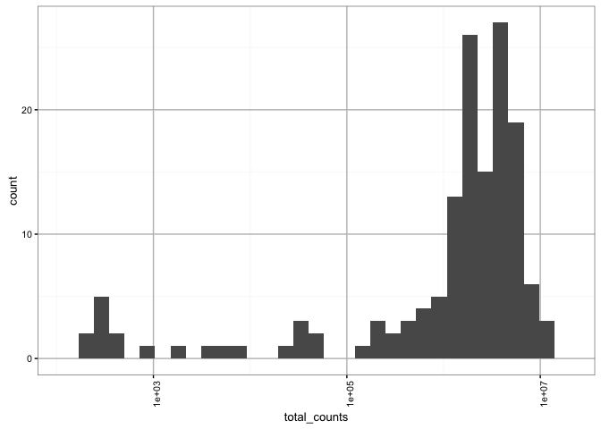

``` r
> b_metadata = subset(b_metadata, total_counts > 1e+05)
> b_combined_counts = b_combined_counts[, rownames(b_metadata)]
```

Fixing that only fixes part of the problem. The distribution of counts per gene for each sample is all over the place too:

``` r
> library(reshape2)
> melted = melt(b_combined_counts)
> colnames(melted) = c("sample", "count")
> melted$sample = factor(melted$sample)
> melted = melted[order(melted$sample), ]
> melted$count = log(melted$count + 1)
> melted = melted %>% left_join(b_metadata, by = "sample")
> ggplot(melted, aes(x = sample, y = count)) + geom_boxplot() + theme_bw(base_size = 10) + 
+     facet_wrap(~run) + theme(panel.grid.major = element_line(size = 0.5, color = "grey"), 
+     axis.text.x = element_text(angle = 90)) + xlab("")
```

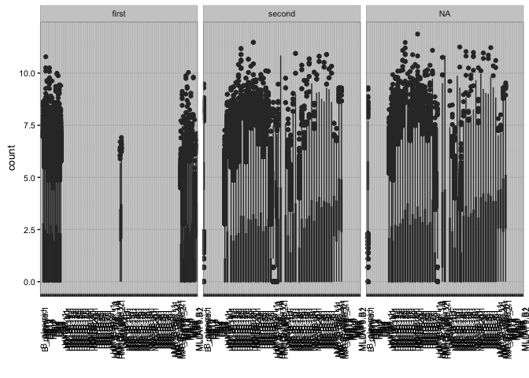

We'd expect if we could reliably measure the counts we should see some similarity in the distribution of the counts.

The overall distribution of counts between the two cell lines is similar, though:

``` r
> ggplot(melted, aes(x = line, y = count)) + geom_boxplot() + theme_bw(base_size = 10) + 
+     facet_wrap(~run) + theme(panel.grid.major = element_line(size = 0.5, color = "grey"), 
+     axis.text.x = element_text(angle = 90)) + xlab("")
```

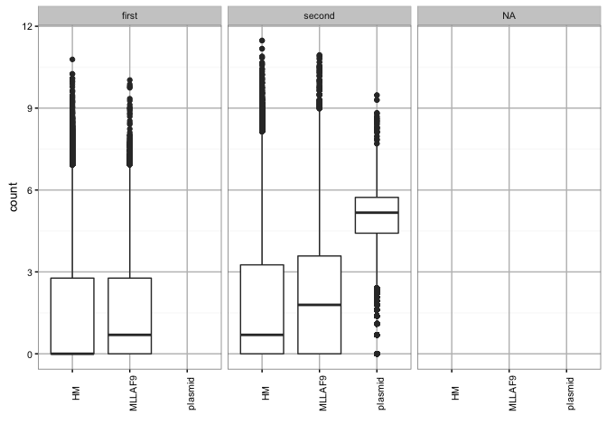

Here we can see that the cells separate out by cell type along the first principal component:

``` r
> library(DESeq2)
> dds = DESeqDataSetFromMatrix(countData = b_combined_counts, colData = b_metadata, 
+     design = ~sample)
> geoMeans = apply(b_combined_counts, 1, function(row) if (all(row == 0)) 0 else exp(mean(log(row[row != 
+     0]))))
> dds = estimateSizeFactors(dds, geoMeans = geoMeans)
> vst = varianceStabilizingTransformation(dds)
> plotPCA(vst, intgroup = c("line"))
```

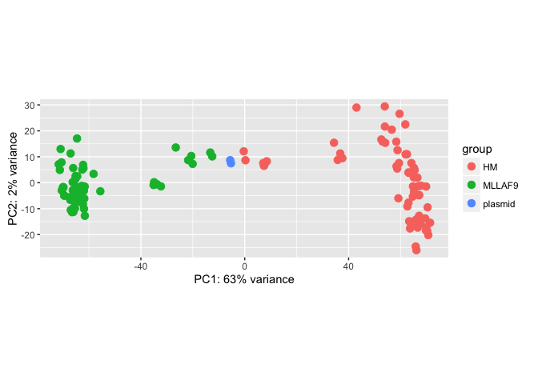

And by log total counts by the second principal component:

``` r
> plotPCA(vst, intgroup = c("ltotal_counts"))
```

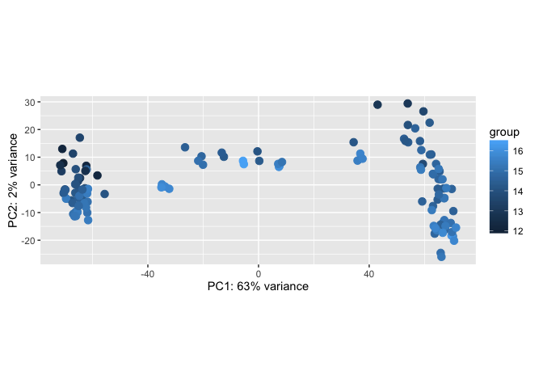

But most of the variance between the samples is explained by the cell line, not the depth of sequencing.

The cluster of samples in the middle are the non-transplanted samples:

``` r
> plotPCA(vst, intgroup = c("transplant"))
```

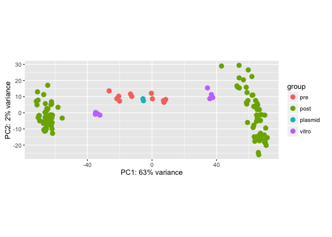

The two libraries are pretty similar.

Final cleanup
-------------

Before we are done, we have to combine the samples that are technical replicates of each other. It wasn't 100% clear over Basecamp, but I think that the combination of the cell line, the library that was run and its transplant status specifies which sample it is. We added that column as `derived` to the sample metadata to use as the identifier for which sample a set of counts is from, then we sum all of the counts for each sample with the same derived name.

We also think there may have been a sample swap:

    However, looking at those sheets, it looks like the HM-A and HM-B samples were mislabeled. The HM-A samples have high library B reads, and low library A reads, while the HM-B samples have low library B reads and high library A reads. I think that HM-A1 should actually be HM-B1 and HM-B1 should actually be HM-A1, and the same for HM-A2 and HM-B2.

So we'll fix that here, before combining. We need to swap the derived names and the library for those samples.

``` r
> a_combined_samples["HM.B1", c("library", "derived")] = c("A", "HM_A_pre_1")
> a_combined_samples["HM.B2", c("library", "derived")] = c("A", "HM_A_pre_2")
> b_combined_samples["HM.A1", c("library", "derived")] = c("B", "HM_B_pre_1")
> b_combined_samples["HM.A2", c("library", "derived")] = c("B", "HM_B_pre_2")
```

Now we'll merge the technical replicates.

For the `Gecko A` library:

``` r
> a_melting = a_combined_counts
> a_melting$id = rownames(a_melting)
> a_melting = melt(a_melting)
> colnames(a_melting) = c("UID", "sample", "count")
> a_melting = a_melting %>% left_join(a_combined_samples, by = "sample")
> a_counts = a_melting %>% group_by(UID, derived) %>% summarize(counts = sum(count)) %>% 
+     select(UID, derived, counts) %>% na.omit() %>% spread(derived, counts)
> a_counts = data.frame(a_counts)
> rownames(a_counts) = a_counts$UID
> a_counts$UID = NULL
```

and the `Gecko B` libary:

``` r
> b_melting = b_combined_counts
> b_melting$id = rownames(b_melting)
> b_melting = melt(b_melting)
> colnames(b_melting) = c("UID", "sample", "count")
> b_melting = b_melting %>% left_join(b_combined_samples, by = "sample")
> b_counts = b_melting %>% group_by(UID, derived) %>% summarize(counts = sum(count)) %>% 
+     select(UID, derived, counts) %>% na.omit() %>% spread(derived, counts)
> b_counts = data.frame(b_counts)
> rownames(b_counts) = b_counts$UID
> b_counts$UID = NULL
```

Now we are ready to rock. We'll dump out the filtered tables of counts, metadata about the samples and information about the GECKO libraries to a file so we have everything we need to dig into the data further.

``` r
> a_samples = subset(a_combined_samples, derived %in% colnames(a_counts)) %>% 
+     select(-run, -replicate, -sample) %>% unique()
> b_samples = subset(b_combined_samples, derived %in% colnames(b_counts)) %>% 
+     select(-run, -replicate, -sample) %>% unique()
```

``` r
> dir.create("../processed")
> rownames(a_samples) = a_samples$derived
> rownames(b_samples) = b_samples$derived
> a_counts = a_counts[, order(colnames(a_counts))]
> a_samples = a_samples[colnames(a_counts), ]
> b_counts = b_counts[, order(colnames(b_counts))]
> b_samples = b_samples[colnames(b_counts), ]
> save(b_counts, a_counts, b_samples, a_samples, a_gecko, b_gecko, file = "../processed/cleaned.RData")
```
