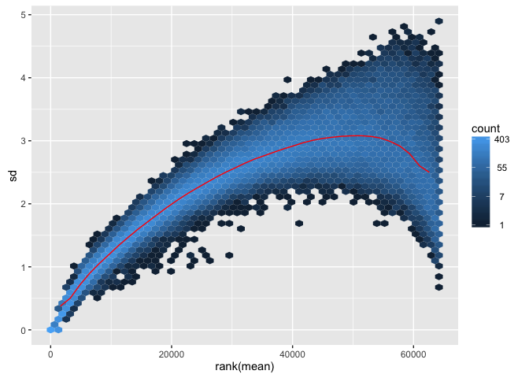
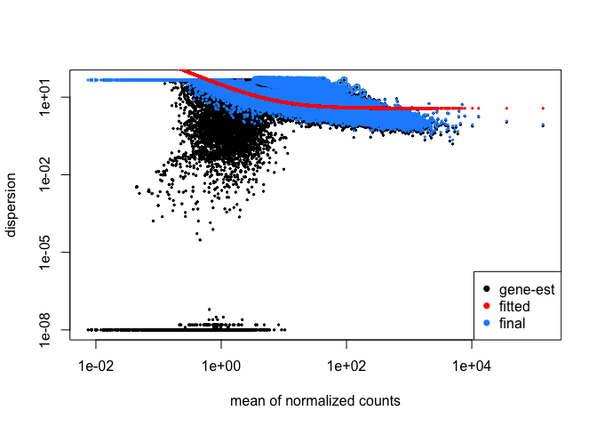
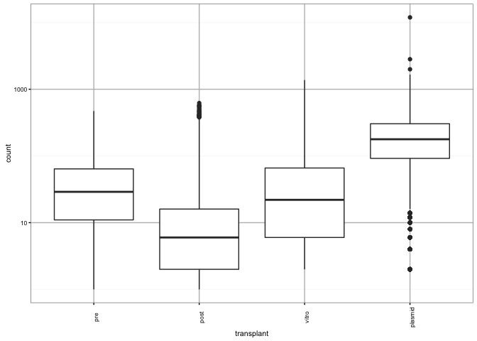
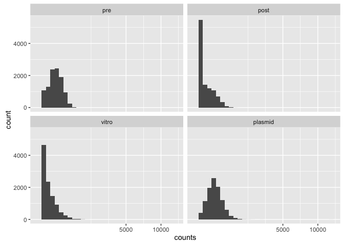
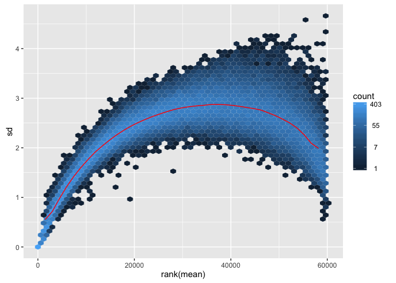
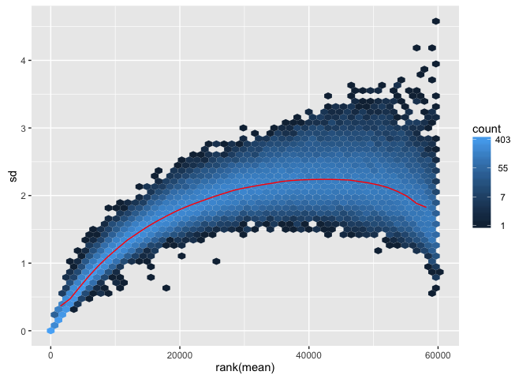
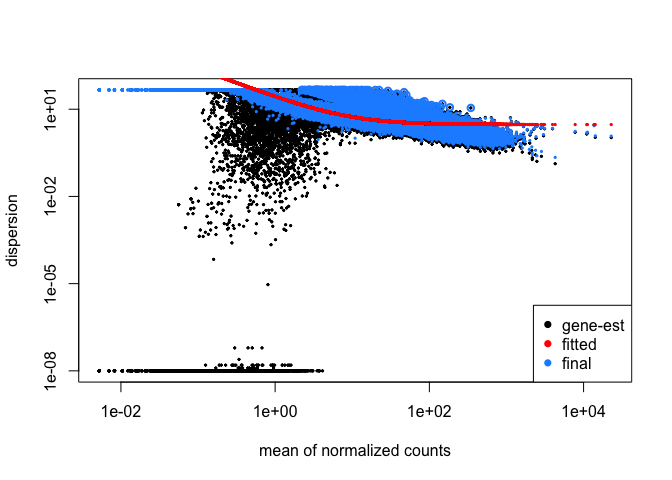
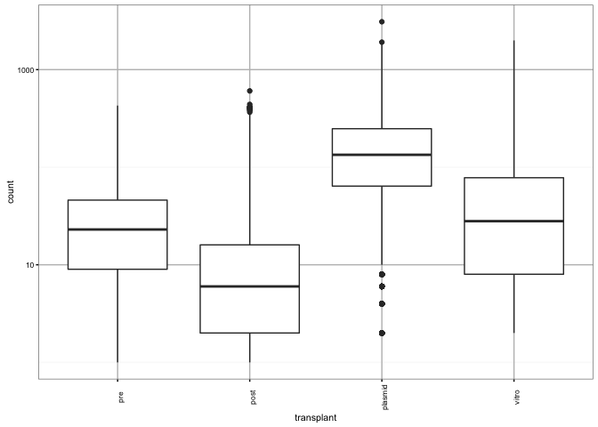
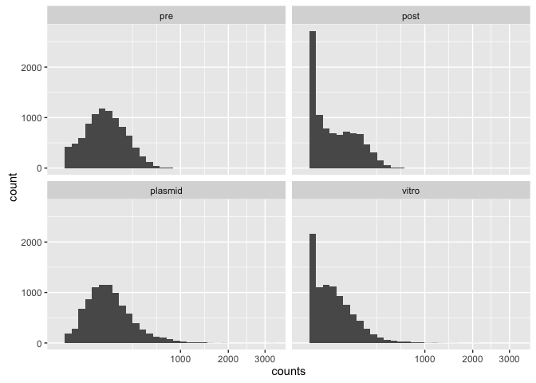

### Differential expression

Over Basecamp, the questions that wanted to be answered from this data are this:

'We're interested in comparing the post-transplant samples (MA, MB, HA, or HB) to the pre-transplant samples. We also have an in vitro comparison to more easily screen out sgRNAs targeting essential cellular components like ribosome genes. Those files aren't in the folder yet, but I should have the sequencing back soon. Ideally, I think we are looking for genes that are depleted across both libraries and in both cell lines compared to the pre-transplant samples. We would probably be more interested in genes that are depleted in the in vivo condition but not in the in vitro condition, although that isn't absolute.'

We can get at those genes by looking at a model that looks like this: `~line + transplant` and then looking at the coefficient on `transplant`, comparing the `pre` and `post` samples to each other. of which library was used and which cell line was used.

In the quality control steps of the analysis, we made the observation the samples seem to separate along the second principal component based on how many total counts there were in the sample. We will also add this to the model, to try to eliminate some false positives that might crop up due to that variation.

``` r
> load("../processed/cleaned.RData")
```

### Add total counts to metadata

Here we added the log total counts to the metadata about each sample, so we can use it as a term in the model and correct for its effect.

``` r
> a_samples[colnames(a_counts), "log_total_counts"] = log(colSums(a_counts))
> b_samples[colnames(b_counts), "log_total_counts"] = log(colSums(b_counts))
```

### DESeq2

We'll fit GLM with DESeq2 to the data-- DESeq2 is designed to handle gene expression from RNA-seq experiments, but can be used on any count data that is expected to be able to be modelled by a negative binomial distribution and has a mean-variance relationship in the data that we can leverage to share information across the observations.

``` r
> library(DESeq2)
> design = ~log_total_counts + line + transplant
> setup_deseq2 = function(counts, samples) {
+     samples = subset(samples, line %in% c("HM", "MLLAF9"))
+     counts = counts[rowSums(counts) > 0, samples$derived]
+     dds = DESeqDataSetFromMatrix(countData = counts, colData = samples, design = design)
+     return(dds)
+ }
```

One super bad thing about this data is that there are not that many observations pre-transplant, there are only two replicates for each cell line. It would be better if these were more balanced in the future.

### Library A

``` r
> dds = setup_deseq2(a_counts, a_samples)
> dds = estimateSizeFactors(dds)
> dds = DESeq(dds)
```

``` r
> library(vsn)
> vsd = varianceStabilizingTransformation(dds)
> meanSdPlot(log2(counts(dds, normalized = TRUE) + 1))
```



``` r
> meanSdPlot(assay(vsd))
```


We can see that many of the counts of UIDs are undispersed compared to UIDs of a similar expression level. This tends to occur for UIDs that are expressed at a low level. Part of this might be because the samples are not balanced, there are 10x more test samples than control samples, and so the measurement of variability is dominated by the test samples.

``` r
> plotDispEsts(dds)
```



What are those UIDs with low dispersion? They tend to be UIDs that are low in the post transplant samples.

``` r
> a_gecko$UID = rownames(a_gecko)
> bm = data.frame(mcols(dds)[, c("baseMean", "dispGeneEst")])
> bm$UID = rownames(dds)
> low = subset(bm, baseMean < 10 & dispGeneEst < 10) %>% left_join(a_gecko, by = "UID")
> low_counts = a_counts[low$UID, ]
> low_counts$UID = rownames(low_counts)
> melted = melt(low_counts)
> colnames(melted) = c("UID", "derived", "count")
> melted = melted %>% left_join(a_samples, by = "derived")
> ggplot(melted, aes(transplant, count)) + geom_boxplot() + scale_y_log10() + 
+     theme_bw(base_size = 8) + theme(panel.grid.major = element_line(size = 0.5, 
+     color = "grey"), axis.text.x = element_text(angle = 90))
```



They are often all zero in the transplant and the in vitro counts:

``` r
> grouped = melted %>% group_by(UID, transplant) %>% summarise(counts = sum(count))
> ggplot(grouped, aes(counts)) + geom_histogram() + facet_wrap(~transplant) + 
+     scale_x_sqrt()
```



So some of these might be UID housekeeping type genes that are necessary for survival independent of transplantation. We'll tag those UID as "housekeeping", so later on we can filter those out. We'll tag all UID that have on average less than 10 counts in the in vitro samples as housekeeping.

``` r
> melted = a_counts
> melted$UID = rownames(a_counts)
> melted = melt(melted)
> colnames(melted) = c("UID", "derived", "count")
> melted = melted %>% left_join(a_samples, by = "derived") %>% filter(transplant == 
+     "vitro") %>% group_by(UID) %>% summarise(counts = mean(count)) %>% filter(counts < 
+     10)
> a_gecko$housekeeping = ifelse(a_gecko$UID %in% melted$UID, "housekeeping", "not housekeeping")
```

And now run the differential expression for the UIDs between pre and post, and tag the results with the metadata about each UID.

``` r
> a_res = results(dds, contrast = c("transplant", "pre", "post"))
> a_res = a_res[order(a_res$pvalue), ]
> a_res = data.frame(a_res)
> a_res$UID = rownames(a_res)
> a_gecko$UID = rownames(a_gecko)
> a_fil = subset(a_res, padj < 0.05 & log2FoldChange > 2) %>% left_join(a_gecko, 
+     by = c(UID = "UID"))
> a_multiple = a_fil[duplicated(a_fil$gene_id), ]
```

### Library B

``` r
> dds = setup_deseq2(b_counts, b_samples)
> dds = estimateSizeFactors(dds)
> dds = DESeq(dds)
```

``` r
> library(vsn)
> vsd = varianceStabilizingTransformation(dds)
> meanSdPlot(log2(counts(dds, normalized = TRUE) + 1))
```



``` r
> meanSdPlot(assay(vsd))
```



We can see that many of the counts of UIDs are undispersed, meaning the counts for those UIDS are less variable than other UIDS of the same expression level. This tends to occur for UIDs that are expressed at a low level. Part of this might be because the samples are not balanced, there are 10x more test samples than control samples, and so the measurement of variability is dominated by the test samples.

``` r
> plotDispEsts(dds)
```



What are those UIDs with low dispersion? They tend to be UIDs that are low in the post transplant samples.

``` r
> bm = data.frame(mcols(dds)[, c("baseMean", "dispGeneEst")])
> bm$UID = rownames(dds)
> b_gecko$UID = rownames(b_gecko)
> low = subset(bm, baseMean < 10 & dispGeneEst < 10) %>% left_join(b_gecko, by = "UID")
> low_counts = b_counts[low$UID, ]
> low_counts$UID = rownames(low_counts)
> melted = melt(low_counts)
> colnames(melted) = c("UID", "derived", "count")
> melted = melted %>% left_join(b_samples, by = "derived")
> ggplot(melted, aes(transplant, count)) + geom_boxplot() + scale_y_log10() + 
+     theme_bw(base_size = 8) + theme(panel.grid.major = element_line(size = 0.5, 
+     color = "grey"), axis.text.x = element_text(angle = 90))
```



They are often all zero in the transplant and the in vitro counts:

``` r
> grouped = melted %>% group_by(UID, transplant) %>% summarise(counts = sum(count))
> ggplot(grouped, aes(counts)) + geom_histogram() + facet_wrap(~transplant) + 
+     scale_x_sqrt()
```



So some of these might be UID housekeeping type genes that are necessary for survival independent of transplantation. We'll tag those UID as "housekeeping", so later on we can filter those out. We'll tag all UID that have on average less than 10 counts in the in vitro samples as housekeeping.

``` r
> melted = b_counts
> melted$UID = rownames(b_counts)
> melted = melt(melted)
> colnames(melted) = c("UID", "derived", "count")
> melted = melted %>% left_join(b_samples, by = "derived") %>% filter(transplant == 
+     "vitro") %>% group_by(UID) %>% summarise(counts = mean(count)) %>% filter(counts < 
+     10)
> b_gecko$housekeeping = ifelse(b_gecko$UID %in% melted$UID, "housekeeping", "not housekeeping")
```

And now run the differential expession for pre and post:

``` r
> b_res = results(dds, contrast = c("transplant", "pre", "post"))
> b_res = b_res[order(b_res$pvalue), ]
> b_res = data.frame(b_res)
> b_res$UID = rownames(b_res)
> b_gecko$UID = rownames(b_gecko)
> b_fil = subset(b_res, padj < 0.05 & log2FoldChange > 2) %>% left_join(b_gecko, 
+     by = c(UID = "UID"))
> b_multiple = b_fil[duplicated(b_fil$gene_id), ]
```

Intersection of both
--------------------

Now we will do something simple and intersect the lists of genes that appear in both differentially expressed lists. So these are all of the genes that had at least two of their UIDs flagged as being differentially expressed between pre and post transplantation.

``` r
> in_both = intersect(a_multiple$gene_id, b_multiple$gene_id)
> write.table(in_both, quote = FALSE, col.names = FALSE, row.names = FALSE, file = "withhk.txt")
```

That leaves us 416 genes that are differentially expressed in both the A and the B libraries and have at least 2 UID in the same gene that are differentially expressed.

Sticking those into WebGestalt and looking at KEGG enriched genes vs. all genes gives these results:

[WebGestalt KEGG analysis](webgestalt/pre-post-KEGG-withhk.html)

And a GO analysis:

[GO analysis](images/pre-post-GO-withhk.gif)

We can also drop UID that were low in the in vitro samples, to try to filter out housekeeping genes:

``` r
> in_both_nohk = intersect(subset(a_multiple, housekeeping != "housekeeping")$gene_id, 
+     subset(b_multiple, housekeeping != "housekeeping")$gene_id)
> write.table(in_both_nohk, quote = FALSE, col.names = FALSE, row.names = FALSE, 
+     file = "nohk.txt")
```

This leaves us with 214 genes.

Sticking those into WebGestalt and looking at KEGG enriched genes vs. all genes gives these results:

[WebGestalt KEGG analysis](webgestalt/pre-post-KEGG-nohk.html)

And a GO analysis:

[GO analysis](images/pre-post-GO-nohk.gif)

I tried doing something better to look at the in vitro UID, but there aren't enough samples to call differential expression very well between the pre-transplant and in-vitro samples. There were no genes that had duplicate UID called significant.

### Summary

That's a first pass look at the results-- for future experiments, it would be good to balance the design more and include more control samples. If we had similar numbers of in vitro, pre transplant and post-transplant samples we could do a nicer job fitting the models and a nicer job calling real differences.

I spit out the two lists of differentially expressed genes between the pre and post transplant samples. The first list: [withhk.txt](withhk.txt) includes the housekeeping genes identified in the in vitro sample and the second list: [nohk.txt](nohk.txt) does not have them.

Let us know what you think.
